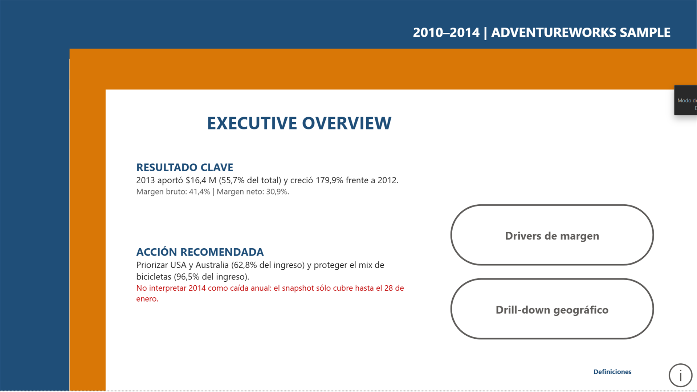
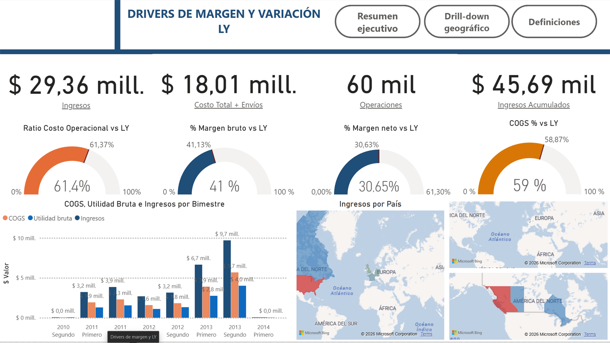
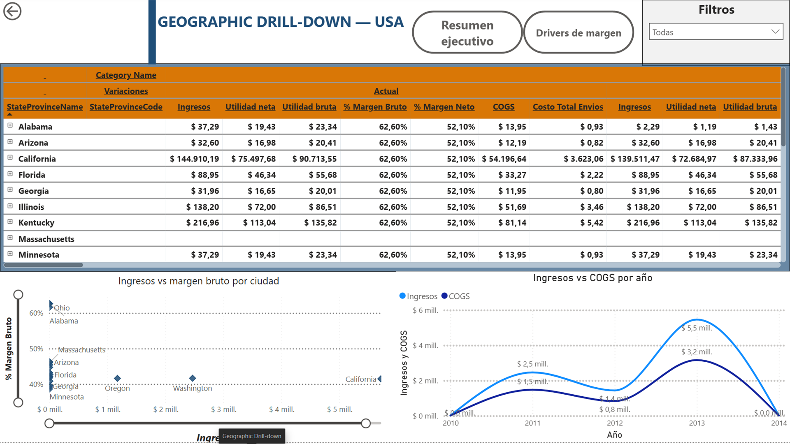
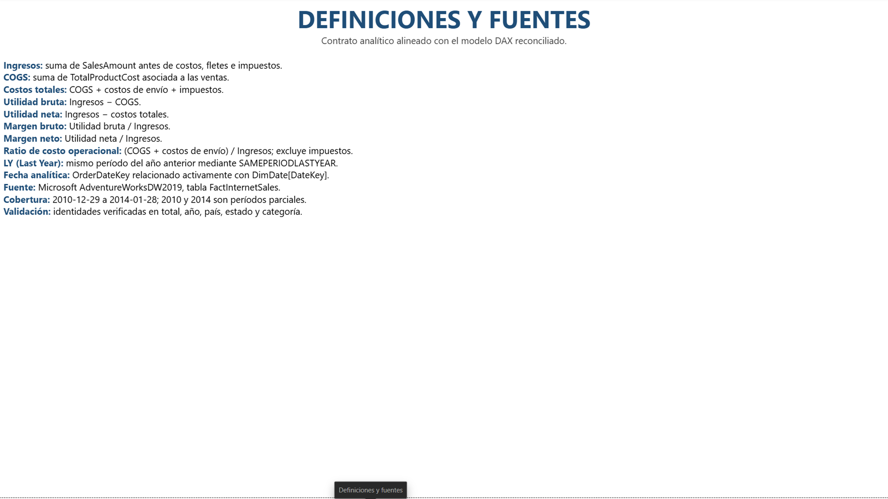

# Financial Performance Dashboard | Power BI

[](https://powerbi.microsoft.com/)
[](https://learn.microsoft.com/en-us/sql/samples/adventureworks-install-configure)
[](DOCS/i1_i3_verification.md)

An executive Power BI case study that connects revenue, product cost, freight, tax, and profitability in one reconciled financial model. It combines a decision-first overview, margin and prior-year drivers, a strictly scoped USA drill-down, and definitions close to their DAX implementation.

> Portfolio stage: **FIN-S1 through FIN-I3 completed**. The next planned stage is **FIN-C1**, automated analytical release and publication.

## Dashboard preview

### Executive overview



### Margin and LY drivers



### USA geographic drill-down



### Definitions and sources



## Executive finding

The strongest complete year in the snapshot is **2013**, with **$16.4M** in revenue: **55.7%** of the full sample and **+179.9%** versus 2012. Its gross margin is **41.4%** and net margin is **30.9%**.

The recommended commercial focus is to protect the bicycle mix, which contributes **96.5%** of revenue, and prioritize the United States and Australia, which together contribute **62.8%**. The 2014 value must not be treated as a full-year decline: the source ends on **2014-01-28**.

## Analytical objective

The report answers four connected questions:

- Is revenue growth translating into stable gross and net profitability?
- How much revenue is absorbed by product cost, freight, and tax?
- Which countries, states, provinces, cities, and product categories concentrate performance?
- Are current KPIs improving or deteriorating against the same selected period last year?

## KPI contract

| Layer | Definition | Interpretation |
|---|---|---|
| Revenue | `SUM(FactInternetSales[SalesAmount])` | Sales scale in the active filter context |
| Gross profit | Revenue − COGS | Profit after product cost |
| Net profit | Revenue − COGS − Freight − Tax | Portfolio operating result |
| Gross margin | Gross profit / Revenue | Product economics |
| Net margin | Net profit / Revenue | Result after the modeled costs |
| Operational cost ratio | (COGS + Freight) / Revenue | Product and fulfillment cost pressure; excludes tax |
| LY | Same selected period one year earlier | Like-for-like time comparison through `SAMEPERIODLASTYEAR` |

The active calendar relationship is `FactInternetSales[OrderDateKey] → DimDate[DateKey]`. All YTD and LY measures therefore follow the business event used by the documented period: order date. The complete 35-measure catalog is in [DOCS/dax_measure_catalog.md](DOCS/dax_measure_catalog.md).

## What each page answers

| Page | Decision supported |
|---|---|
| Executive Overview | What happened, why it matters, and which action deserves priority? |
| Drivers de margen y LY | How do revenue, costs, margins, geography, and prior-year comparisons behave? |
| Geographic Drill-down | Which US states and cities drive revenue and gross margin? |
| Definiciones y fuentes | What does each KPI mean, which date controls it, and what are the data limitations? |

## Data source and scope

- **Exact source:** Microsoft's official `AdventureWorksDW2019.bak` data warehouse sample, documented on [Microsoft Learn — AdventureWorks sample databases](https://learn.microsoft.com/en-us/sql/samples/adventureworks-install-configure) and in the [Microsoft SQL Server samples repository](https://github.com/microsoft/sql-server-samples/tree/master/samples/databases/adventure-works).
- **Fact table:** `FactInternetSales`, with **60,398 embedded rows** in the audited PBIX.
- **Observed order-date period:** **2010-12-29 through 2014-01-28**; 2010 and 2014 are partial years.
- **Reporting currency:** the model displays monetary values with `$`; it does not implement exchange-rate conversion or currency normalization. Values represent the AdventureWorks sample reporting currency, not audited statutory USD.
- **Units:** executive cards display monetary values in millions (`mill.`); ratios use percentages; detailed visuals retain their visual-specific display units.

### USA scope guarantee

The USA page has one stable page-level filter:

```text
DimCustomer[CountryRegionCode] = "US"
```

Its visuals use `DimCustomer` geography fields, so the filter acts on the effective dimension. An offline embedded-table check found 7,819 US customers across 22 state names and no records from the other five countries in that scope. Full evidence is in [DOCS/s1_s3_verification.md](DOCS/s1_s3_verification.md).

## DAX reconciliation

`DOCS/dax_reconciliation.csv` contains **68 evaluated contexts**:

| Granularity | Contexts |
|---|---:|
| Total | 1 |
| Year | 5 |
| Country | 6 |
| State/province | 53 |
| Product category | 3 |

Every context validates these identities with a maximum recorded residual of exactly **0**:

```text
Gross profit = Revenue − COGS
Net profit   = Revenue − COGS − Freight − Tax
Gross margin = Gross profit / Revenue
Net margin   = Net profit / Revenue
```

The year-level rows also verify that each available LY value equals the preceding year's current revenue. See [DOCS/i1_i3_verification.md](DOCS/i1_i3_verification.md) for the verification record and reproduction commands.

## Reproduce the report

### Fast path: inspect the embedded result

1. Download `Financial_Report.pbix`.
2. Open it with Power BI Desktop.
3. Review the four pages and confirm the US page filter in the Filters pane.
4. Compare the visible totals with `DOCS/dax_reconciliation.csv`.

The PBIX contains the audited snapshot, so the result can be inspected without a database connection.

### Refreshable template

`Financial_Report.pbit` is a data-free template compiled from the reviewable source. Restore `AdventureWorksDW2019.bak`, open the template, point it to your SQL Server instance when prompted, and refresh.

The documented default source is `localhost\SQLEXPRESS`. `DimCustomer` is loaded from the same database; no workstation-only Excel path remains.

### Repeat the source transformations and checks

```powershell
python scripts/update_financial_report_s1_s3.py
python scripts/update_financial_report_i1_i3.py
python scripts/validate_s1_s3.py
python scripts/validate_i1_i3.py
```

With the PBIX open in Power BI Desktop on Windows, the live model and reconciliation evidence can also be regenerated:

```powershell
powershell -ExecutionPolicy Bypass -File scripts/apply_live_model_i1.ps1
powershell -ExecutionPolicy Bypass -File scripts/export_dax_reconciliation.ps1
python scripts/sync_report_layout_to_pbix.py
```

The PowerShell scripts discover the local Analysis Services endpoint created by the open report. The Python transformations are idempotent and the GitHub workflow fails if committed report source drifts from their output.

## Version-control format

The canonical reviewable artifact is the `pbi-tools`-compatible `Financial_Report/` source: report JSON plus TMDL semantic model. The repository also distributes the compiled PBIT and the embedded-data PBIX.

A native `.pbip` was deliberately not fabricated. Microsoft currently documents Power BI Desktop projects as a preview feature that must be enabled in Desktop; converting only the semantic model while claiming an unverified native report project would weaken reproducibility. The adopted source still provides text diffs, automated checks, a rebuildable template, and a tested PBIX. See [Power BI Desktop projects](https://learn.microsoft.com/en-us/power-bi/developer/projects/projects-overview) and [TMDL semantic model projects](https://learn.microsoft.com/en-us/power-bi/developer/projects/projects-dataset).

## Repository structure

```text
.
├── Financial_Report.pbix       # Report with embedded audited sample data
├── Financial_Report.pbit       # Refreshable, data-free template
├── Financial_Report/           # Reviewable report JSON and TMDL model source
├── Images/                     # Four verified 1920×1080 report previews
├── DOCS/
│   ├── dax_measure_catalog.md  # Formula, unit, context, and LY contract
│   ├── dax_reconciliation.csv  # Numerical evidence at five granularities
│   └── i1_i3_verification.md   # Intermediate-stage verification record
├── scripts/                    # Idempotent transforms, live-model tools, validation
└── .github/workflows/          # Automated source and evidence checks
```

## Completed portfolio stages

- **FIN-S1 — USA consistency:** stable US page filter, effective geography dimension, embedded-data scope check, and interaction review.
- **FIN-S2 — documentation:** exact source, period, row count, units, page decisions, reproduction paths, and limitations.
- **FIN-S3 — presentation:** terminology correction, restrained visual system, cleaner navigation, and unclipped definitions.
- **FIN-I1 — analytical model:** corrected active order-date relationship, normalized 35 measures, added descriptions/folders and four diagnostic identities, and reconciled 68 filter contexts.
- **FIN-I2 — versionability:** synchronized TMDL/report source, compiled PBIT, repeatable update/export scripts, automated drift checks, and an explicit native-PBIP decision.
- **FIN-I3 — analytical narrative:** rebuilt the four-page flow around result, driver, action, drill-down, and data contract; added exact findings and partial-period warnings.

## Limitations

- AdventureWorks is a synthetic Microsoft sample, not a live company ledger.
- The snapshot begins on 2010-12-29 and ends on 2014-01-28; 2010 and 2014 cannot be compared as complete fiscal years.
- `SAMEPERIODLASTYEAR` follows the selected calendar window. Annual interpretations should use complete years or aligned partial periods.
- Currency conversion, budgets, forecasts, accounting-close adjustments, and scenario planning are outside the current model.
- Maps depend on Power BI geocoding. Explicit country scope reduces ambiguity but does not replace governed latitude/longitude data.
- The report has standard tooltips and page navigation; it does not yet implement a dedicated tooltip page or drillthrough target.
- Native PBIP export remains outside the committed artifact for the preview/verification reason documented above.

## Tools

- Power BI Desktop and DAX
- SQL Server / AdventureWorksDW2019
- TMDL and `pbi-tools`-compatible extracted source
- PowerShell live-model automation
- Python standard-library transformation and validation

## Attribution

Original report and analytical model by **Percy Ignacio Marzoratti Hill**. Portfolio hardening, reproducibility checks, and repository maintenance are tracked in Git history.
